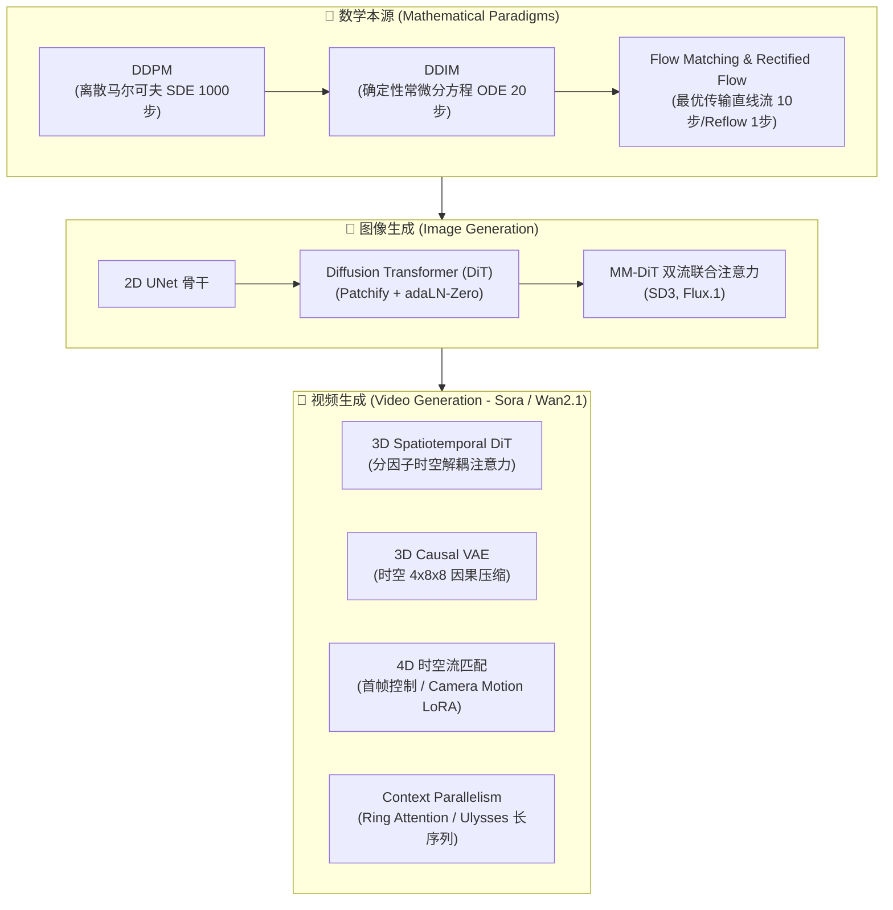

# GenAI 视觉大模型全景知识库 (Vision GenAI Master Knowledge Base)

> **定位**: 专为顶级大厂 Senior/Staff MLE、GenAI Researcher 面试准备与系统性技术储备打造的高质量、深度结构化知识库。
> **涵盖领域**: 图像生成 (Image Gen)、视频生成 (Video Gen)、3D 空间智能与工业级长序列并行系统。

---

## 🗺️ 知识库全局架构目录

```
projects/interview_prep/domain_knowledge/
├── index.html                           # 🌟 全局总门户：Visual GenAI Universe 大看板
├── README.md                            # 📖 全局 Markdown 大纲与技术索引
│
├── 01_image_gen/                        # 🎨 图像生成核心专题 (Image Generation)
│   ├── index.html                       # 图像生成专题总览与 2D 轨迹模拟器看板
│   ├── 01_ddpm.html / .md               # 01. DDPM (加噪、贝叶斯后验、MSE、信噪比 SNR)
│   ├── 02_ddim.html / .md               # 02. DDIM (非马尔可夫、ODE 极限、Exact Inversion、1000步迷思)
│   ├── 03_flow_matching.html / .md      # 03. Flow Matching & Rectified Flow (最优传输、直线路径)
│   ├── 04_dit_architecture.html / .md   # 04. DiT & MM-DiT (Patchify, adaLN-Zero, SD3/Flux 双流)
│   └── 05_control_distillation.html/.md # 05. ControlNet, IP-Adapter, Consistency Models & ADD 极速蒸馏
│
├── 02_video_gen/                        # 🎥 视频生成前沿专题 (Video Generation)
│   ├── index.html                       # 视频生成总览、SOTA 横向矩阵看板 (Sora, Wan 2.1, Hunyuan)
│   ├── 01_spatiotemporal_dit.html / .md # 01. 时空 3D DiT (3D Patchify, Factorized Attention, 3D RoPE)
│   ├── 02_causal_3d_vae.html / .md      # 02. 3D Causal VAE (时间因果卷积, 4x8x8 压缩)
│   ├── 03_video_flow_matching.html /.md # 03. 视频流匹配与 I2V 条件控制 (首帧 Concat vs Cross-Attn)
│   └── 04_long_video_consistency.html   # 04. 长视频生成与时序一致性 (自回归扩散, 滑动窗口, 动态 FPS)
│
└── 03_evaluation_systems/               # 📊 评测体系与工业并行系统
    ├── index.html                       # 评测基准 (FID, FVD, VBench) 与长序列并行 (Context Parallelism)
    └── README.md
```

---

## ⚡ 核心理论与技术演进路线



---

## 🎯 顶级大厂 MLE 面试高频问题覆盖

1. **DDPM vs DDIM 的真正区别？为什么 DDIM 可以跨步？**
2. **什么是信噪比 SNR？为什么 SNR≈0 时单步直接预测 x0 会导致一团浆糊？**
3. **为什么 DiT 架构可以取代 UNet？Scaling Law 在生成模型中如何体现？**
4. **视频生成为什么必须用 3D Causal VAE 而不是 2D VAE 或非因果 3D VAE？**
5. **面对 100k+ 视频 Token，如何用 Ring Attention 和 DeepSpeed Ulysses 实现长序列并行？**
6. **I2V 图像动画化中，首帧拼接 (Concat) 与交叉注意力 (Cross-Attn) 各自的优劣与工业选择？**
